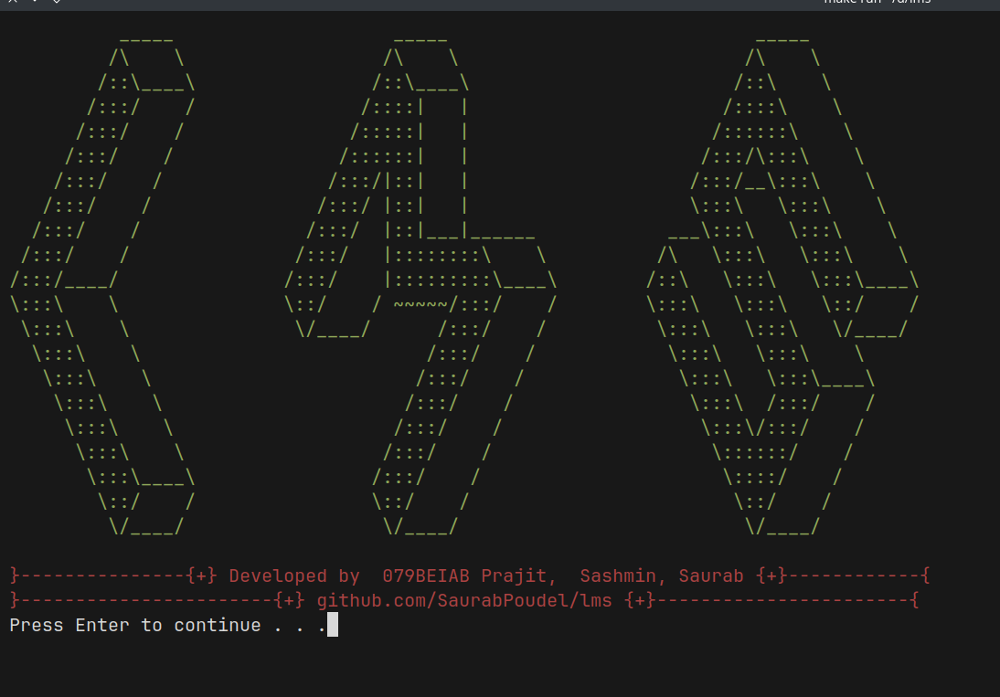
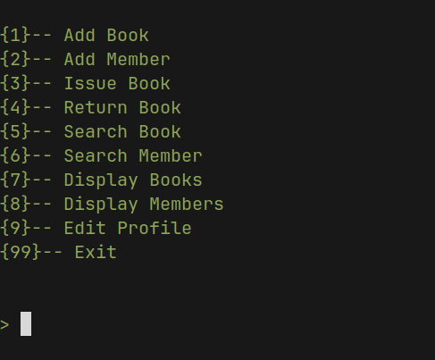

# Library Management System

The Library Management System is a command-line application that allows managing books in a library. This project is developed in C and provides functionalities to add books, display book details, search for books, and manage borrowing and returning of books. To add features follow the CONTRIBUTING.md file.



## Prerequisites

- GCC compiler (MinGW for windows users and GCC for Linux users)

## Getting Started

### Clone the Repository

1. Open a terminal or command prompt.
2. Change the current working directory to the location where you want to clone the project.
3. Run the following command to clone the repository:

```
git clone https://github.com/SaurabPoudel/lms.git
```

### Build

```
 make 
```
windows 
```
mingw32-make
```
### Clean the Project

1. Open a terminal or command prompt.
2. Change the current working directory to the location where you have cloned the project.
3. Run the following command to clean the project:

Linux User

```
make clean
```

Windows User

```
mingw32-make clean
```

### Clean the data files

1. Open a terminal or command prompt.
2. Change the current working directory to the location where you have cloned the project.
3. Run the following command to clean the data files:

Linux User

```
make cleandatafolder
```

Windows User

```
mingw32-make clean-data-folder
```

### If you are getting error like "Error deleting original file"s

1. Open a terminal or command prompt.
2. Change the current working directory to the location where you have cloned the project.

Linux User

```
sudo make change-permission
```

Windows User

```
mingw32-make change-permission-win

```

## About the Project

### Features

- Add User
- Edit User Profile
- Add books
- Display book details
- Search for books
- Manage borrowing and returning of books
